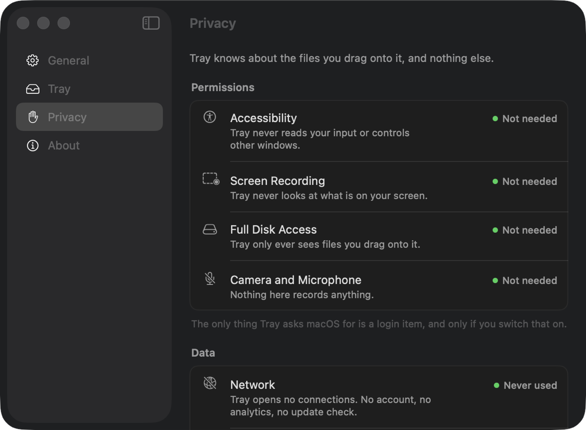

<p align="center">
  <picture>
    <source media="(prefers-color-scheme: dark)" srcset="docs/assets/readme/logo-dark.svg">
    
  </picture>
</p>

<h1 align="center">Tray</h1>

<p align="center">
  A shelf at the top of your screen.<br>
  Drag files in, drag them back out, and nothing on disk moves.
</p>

<p align="center">
  <a href="#install">Install</a> ·
  <a href="#what-it-does">What it does</a> ·
  <a href="#your-files-stay-where-they-are">Privacy</a> ·
  <a href="#build-it-yourself">Build</a> ·
  <a href="CHANGELOG.md">Changelog</a> ·
  <a href="docs/SPEC.md">Spec</a>
</p>

<p align="center">
  <a href="https://github.com/DarkZeen/Tray/releases"></a>
  <a href="https://github.com/DarkZeen/Tray/releases"></a>
  <a href="https://github.com/DarkZeen/Tray/actions/workflows/ci.yml"></a>
  <a href="#what-you-need"></a>
  <a href="LICENSE"></a>
</p>

<p align="center">
  
</p>

Moving a file between two windows on a Mac usually means arranging both of them on screen first. Tray removes that step. Throw the file at the top of your screen, go find the window you actually wanted, and pull the file back out when you get there.

That is the entire product. There is no media player, no clipboard history, no weather, no AI. One shelf, doing one thing.

## What it does

- **Drag files up, and the shelf opens to catch them.** Aim roughly at the top centre of the screen — the drop target is much wider than the shelf looks, so you do not have to be precise. Drop several at once if you like.
- **Nothing moves on disk.** The shelf holds a reference to the file, not a copy. Your photo stays on the Desktop the whole time it is sitting in the tray.
- **Drag them back out into anything.** A Finder window, a Save dialog, an upload field, another app. It is a real macOS drag, so every destination that takes a file takes this one.
- **It knows about the notch.** On a MacBook with a camera housing the closed shelf *is* the housing — same width, same height, hanging off the same edge. On any other display it is a small capsule in the same place. Both are measured from the display, never hardcoded, so external monitors and scaling changes are just other numbers.
- **Every display gets one.** Drag toward the top of your second monitor and that monitor's shelf answers. Connect or disconnect a screen and the shelves follow.
- **It stays out of the way.** Empty and idle, the tray is a faint line you can ignore. Holding something, it is a small pill with a dot per file. It never takes focus, so dragging at it does not pull you out of whatever you were doing.
- **Secondary click for the rest.** Remove from Tray, Reveal in Finder, Quick Look. Three items, because it is a shelf and not a file manager.

<p align="center">
  
  
</p>

## Settings

Four pages, and most of them you will open once. General has Launch at Login and the menu bar icon; Tray has what opens the shelf, how long it waits before closing, and whether file names show.

The Privacy page is the one worth a look. It is the same page other menu bar apps use to explain which permissions they need — except that Tray's version is a list of the ones it does not.

<p align="center">
  
</p>

## Your files stay where they are

Tray knows about the files you drag onto it and nothing else. No account, no analytics, no network — the app never opens a connection, so there is nothing to opt out of.

It also asks for no permissions at all. Not Full Disk Access, not Accessibility, not Screen Recording. A file arrives because you dragged it, and that is the only way anything gets in.

The shelf lives in memory for as long as the app is running. Quit Tray and the shelf is empty; every file it was holding is exactly where you left it.

## What you need

- A Mac with Apple Silicon
- macOS 26 or newer

## Install

Download the disk image from the [releases page](https://github.com/DarkZeen/Tray/releases) and drag Tray into Applications.

Release builds are signed with an Apple Developer ID and notarized, so macOS opens them without complaint. If you are running a build you made yourself, macOS will ask you to confirm the first launch — see [troubleshooting](docs/TROUBLESHOOTING.md).

Tray has no Dock icon. It lives in the menu bar, and at the top of your screen.

## Build it yourself

```sh
git clone https://github.com/DarkZeen/Tray.git
cd Tray
./Scripts/setup-signing.sh   # once: a stable local signing identity
./Scripts/build.sh --install # compile, assemble, sign, install, launch
```

Xcode Command Line Tools are the only requirement — there is no `.xcodeproj`, and nothing here needs a paid Apple Developer account. `./Scripts/setup-signing.sh` is worth running before your first build: without a stable signature macOS treats every rebuild as a different app and quietly drops the Launch at Login setting.

```sh
./Scripts/build.sh            # build into build/
./Scripts/build.sh --dev      # separate bundle id, coexists with an installed release
./Scripts/build.sh --debug    # debug build; TRAY_DEBUG=1 then shows a geometry overlay
./Scripts/test.sh             # run the tests
./Scripts/test.sh --previews  # also render the interface into build/previews
./Scripts/create-dmg.sh       # build the disk image into dist/
```

The [contributing guide](CONTRIBUTING.md) covers the layout and the conventions. [docs/SPEC.md](docs/SPEC.md) is the specification the app was built against, kept in the repository because it is the reason most decisions here are the way they are.

## When something misbehaves

The [troubleshooting guide](docs/TROUBLESHOOTING.md) covers the usual cases: the app blocked on first launch, Launch at Login not sticking, the shelf not appearing over a full-screen app, thumbnails showing as plain icons.

## Documentation

- [Troubleshooting](docs/TROUBLESHOOTING.md), the common fixes
- [Privacy](docs/PRIVACY.md), what does and does not leave your Mac
- [Contributing](CONTRIBUTING.md), build, layout and conventions
- [Specification](docs/SPEC.md), what was built and why
- [Changelog](CHANGELOG.md)

## License

[MIT](LICENSE).
